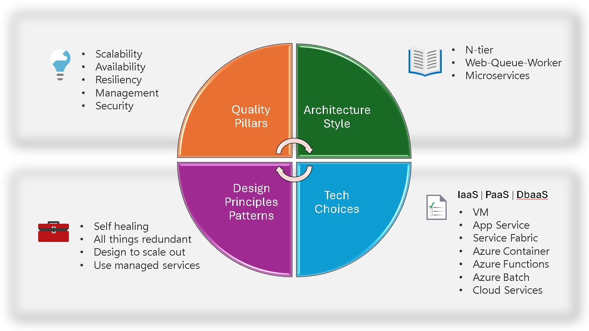

## Arquiteturas - Conceitual

## Referencias do módulo

1. [Migrate or modernize first?](https://learn.microsoft.com/en-us/azure/cloud-adoption-framework/adopt/migrate-or-modernize)

2. [Enterprise web app patterns](https://learn.microsoft.com/en-us/azure/architecture/web-apps/guides/enterprise-app-patterns/overview)

3. [Technology choices for Azure solutions](https://learn.microsoft.com/en-us/azure/architecture/guide/technology-choices/technology-choices-overview)

4. [Architecture styles](https://learn.microsoft.com/en-us/azure/architecture/guide/architecture-styles/)

5. [attern catalog](https://learn.microsoft.com/en-us/azure/architecture/patterns/#pattern-catalog)