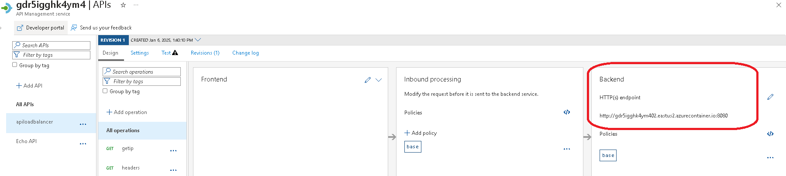
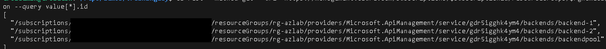
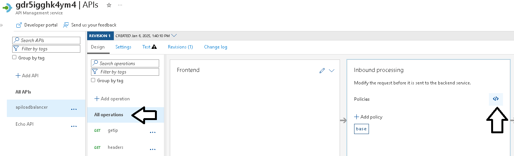

## APIM

1. Criar uma instancia do Azure API Management

        ```
        az apim create --name "apim"$resourcename --publisher-email 'seuemail@dominio.com' --publisher-name 'seunome' --resource-group $rgnameaz --enable-managed-identity true --location $location --public-network-access true --sku-capacity 1 --sku-name Standard
        ```

## Publicar as APIs no APIM

2. Publicar as aplicações do container instancia através do Azure APIM.

    ```
    for i in 01 02
        do
            instancename="${instancename_prefix}${i}"
            echo "aciid"${i}

            export httpbackend=$(az container show --resource-group $rgnameaz --name $instancename -o tsv --query "ipAddress.fqdn")
            export httpport=$(az container show --resource-group $rgnameaz --name $instancename -o tsv --query "ipAddress.ports[0].port")
            export backendAurl=$httpbackend":"$httpport

            az apim api create --api-id apilb${i} --display-name apiloadbalancer${i} --path apilb${i} --service-name "apim"$resourcename --resource-group $rgnameaz --service-url http://$backendAurl
            az apim api operation create --api-id apilb${i} --display-name getip --method get --service-name "apim"$resourcename --resource-group $rgnameaz --url-template /getip
            az apim api operation create --api-id apilb${i} --display-name headers --method get --service-name "apim"$resourcename --resource-group $rgnameaz --url-template /headers
        done
    ```

## PlayGround

Agora que temos nosso API Managament devidamente configurado é hora de realizarmos alguns setups e explorar funcionalidades para o uso na construção de um barramento de APIs.

1. Nosso primeiro cenário é explorar as capacidades de Load Balancer do APIM para dois endpoints diferentes. Examine a atual configuração da API  **"apiloadbalancer"**, ela possui um backend estático apontando para nossa container APP01 e APP02.

    

2. Vamos adicionar alguns objetos no Azure APIM chamados de Backends, uma para cada APP que temos e depois criar um Pool (tipo não disponivel na interface gráfica) apontando para estes dois backends.

    ```
    ## Criar variaveis para o Endpoint do APP 01
    export subscriptionid=$(az account show -o tsv --query id)
    export backendAid="backend-1"
    export httpbackenda=$(az container show --resource-group $rgnameaz --name app01 -o tsv --query "ipAddress.fqdn")
    export httpporta=$(az container show --resource-group $rgnameaz --name app01 -o tsv --query "ipAddress.ports[0].port")
    export backendAurl=$httpbackenda":"$httpporta

    ## Criar o backend APP01
    az rest --method put \
        --url https://management.azure.com/subscriptions/$subscriptionid/resourceGroups/$rgnameaz/providers/Microsoft.ApiManagement/service/apim$resourcename/backends/$backendAid?api-version=2024-06-01-preview \
        --body "{\"name\": \"$backendAid\",\"properties\": {\"credentials\": {\"header\": {},\"query\": {}},\"description\": \"$backendAid\",\"protocol\": \"http\",\"title\": null,\"tls\": {\"validateCertificateChain\": true,\"validateCertificateName\": true},\"url\": \"http://$backendAurl\"}}"

    ## Criar variaveis para o Endpoint do APP 02
    export backendBid="backend-2"
    export httpbackendb=$(az container show --resource-group $rgnameaz --name app02 -o tsv --query "ipAddress.fqdn")
    export httpportb=$(az container show --resource-group $rgnameaz --name app02 -o tsv --query "ipAddress.ports[0].port")
    export backendBurl=$httpbackendb":"$httpportb

    ## Criar o backend APP02
    az rest --method put \
        --url https://management.azure.com/subscriptions/$subscriptionid/resourceGroups/$rgnameaz/providers/Microsoft.ApiManagement/service/apim$resourcename/backends/$backendBid?api-version=2024-06-01-preview \
        --body "{\"name\": \"$backendBid\",\"properties\": {\"credentials\": {\"header\": {},\"query\": {}},\"description\": \"$backendBid\",\"protocol\": \"http\",\"title\": null,\"tls\": {\"validateCertificateChain\": true,\"validateCertificateName\": true},\"url\": \"http://$backendBurl\"}}"

    ## Criar o backend do tipo POOL com os dois backends anteriores.
    az rest --method put \
        --url https://management.azure.com/subscriptions/$subscriptionid/resourceGroups/$rgnameaz/providers/Microsoft.ApiManagement/service/apim$resourcename/backends/backendpool?api-version=2024-06-01-preview \
        --body '{"properties": {"title": null,"description": "backend pool teste","type": "Pool","url": null,"protocol": null,"pool": {"services": [{"id": "/subscriptions/$subscriptionid/resourceGroups/$rgnameaz/providers/Microsoft.ApiManagement/service/$resourcename/backends/backend-1","weight": 3,"priority": 1},{"id": "/subscriptions/$subscriptionid/resourceGroups/$rgnameaz/providers/Microsoft.ApiManagement/service/$resourcename/backends/backend-2","weight": 1,"priority": 1 }]}}}'

    ```
3. Podemos consultar os objetos criados através desta chamada REST. Deve retornar 3 IDs.

    ```
    az rest --method get --url "https://management.azure.com/subscriptions/$subscriptionid/resourceGroups/$rgnameaz/providers/Microsoft.ApiManagement/service/apim$resourcename/backends?api-version=2024-06-01-preview" -o json --query value[*].id

    ```
    

Para que nossa API faça uso destes objetos, precisamos ajustar a politica dentro da API, podemos fazer em diferentes escopos (Geral, API, Metodo). No nosso exemplo, vamos fazer a configuração do Backend para a API.

4. No portal do Azure > APIM > APIs > APIM > **"apiloadbalancer"** > na TAB design > All operations. No quadro de **"inbound processing"** clicar no "policy code editor".

    

5. No editor, localizar no XML a seção inbound e depois da linha \<base /> adicionar a linha ```<set-backend-service backend-id="backendpool" /> ``` e clicar em salvar.

> Nota: Ignorar o erro "Could not load policies. Please try again later.".

6. Realizar novos testes na API com o endpoint /getip. Observar o valor da resposta JSON "hostname" que vai alternar com o hostname da instancia das APP01 e APP02.

    ```
    curl -X GET https://apim$resourcename.azure-api.net/apilb01/getip
    ```

## Referencias do módulo

1. [Azure APIM instance to a virtual network - internal mode](https://learn.microsoft.com/en-us/azure/api-management/api-management-using-with-internal-vnet?tabs=stv2)

2. [Backends in API Management](https://learn.microsoft.com/en-us/azure/api-management/backends?tabs=bicep)

3. [API Management policy reference](https://learn.microsoft.com/en-us/azure/api-management/api-management-policies)

4. [API Management policy expressions](https://learn.microsoft.com/en-us/azure/api-management/api-management-policy-expressions)

5. [Protect your APIs with Defender for APIs](https://learn.microsoft.com/en-us/azure/defender-for-cloud/defender-for-apis-deploy)

6. [Enable API security posture with Defender CSPM](https://learn.microsoft.com/en-us/azure/defender-for-cloud/enable-api-security-posture)

7. [Architecture: Protect APIs with Application Gateway and API Management](https://learn.microsoft.com/en-us/azure/architecture/web-apps/api-management/architectures/protect-apis)

8. [Techcommunity: Introducing GenAI Gateway Capabilities in Azure API Management](https://techcommunity.microsoft.com/blog/integrationsonazureblog/introducing-genai-gateway-capabilities-in-azure-api-management/4146525)

9. [Techcommunity: Integrating API Management with App Gateway V2](https://techcommunity.microsoft.com/blog/azurepaasblog/integrating-api-management-with-app-gateway-v2/1241650 )

10. [Apim LandingZoneAccelerator](https://github.com/Azure/apim-landing-zone-accelerator/tree/main)

11. [AI Gateway](https://github.com/Azure-Samples/AI-Gateway/tree/main)
